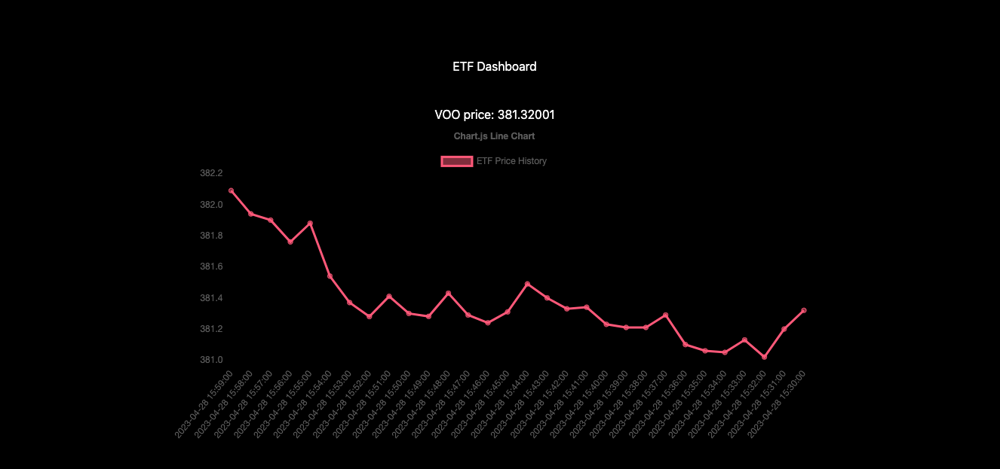

## ETF Dashboard

### Description
This is a dashboard that tracks the prices of 5 ETFs: VOO, QQQ, VUG, and AVUV. The prices are shown in real-time which refreshes every 30 seconds due to API rate limiting constraints. I multithreaded the API calls to enable concurrent calls to the API rather than have them be sequential.

### Learnings
The purpose of this project was to learn how to apply multithreading in a practical setting and learn how to create a frontend to handle real-time data. 

### Technologies Used
React, Typescript, Next.js, Node.js, and Tailwind.
